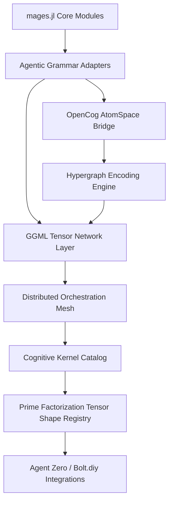
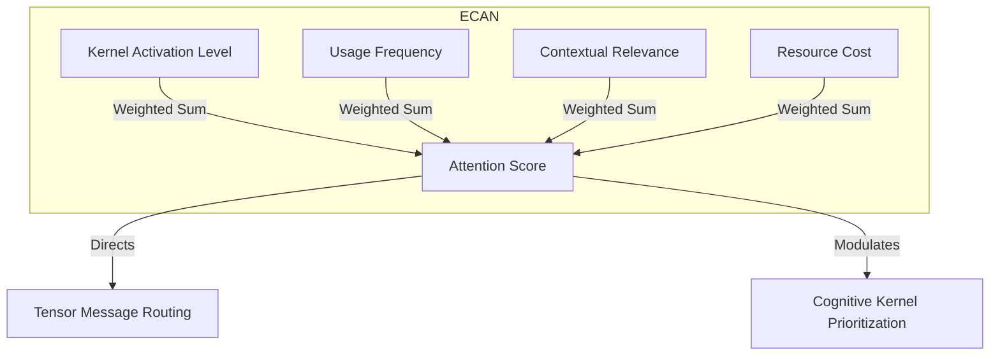
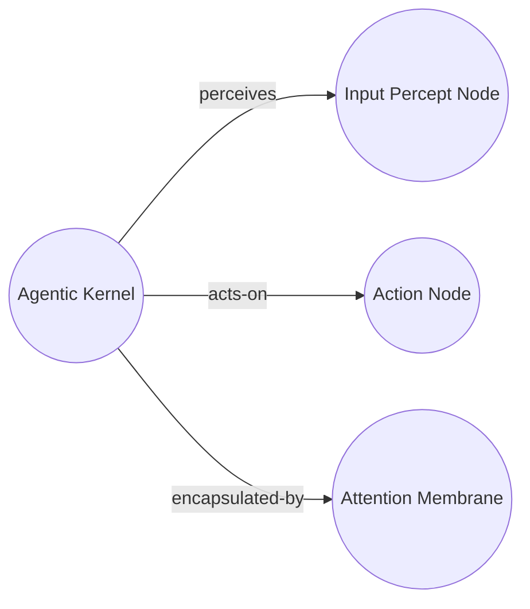

# Distributed GGML Tensor Network of Agentic Cognitive Grammar

This document provides a comprehensive overview of the distributed GGML tensor network of agentic cognitive grammar integration for Agents.jl, following the architecture specified in the original issue.

## 1. Cognitive Flowchart Overview



## 2. Implementation Architecture

### Core Components

The cognitive architecture extends Agents.jl with the following modules:

- **`AgenticGrammar`**: Grammar extraction and symbolic ↔ subsymbolic mapping
- **`TensorNetwork`**: GGML-compatible tensor network layer for distributed cognition
- **`CognitiveKernel`**: Individual cognitive processing units with prime factorization shapes
- **`OrchestrationMesh`**: Distributed orchestration with adaptive attention allocation
- **`AtomSpaceBridge`**: Integration with OpenCog-style hypergraph representations
- **`HypergraphEncoding`**: Graph-based encoding of cognitive patterns

### 2.1 Agentic Grammar Adapters

The grammar adapters extract cognitive primitives from agent behaviors:

```julia
# Extract agentic primitives from an agent
primitives = extract_agentic_primitives(agent, model)

# Convert to cognitive tokens
grammar = AgenticGrammar{Float64}()
tokens = map_to_cognitive_tokens(grammar, primitives)

# Bridge to subsymbolic representation
weights = symbolic_to_subsymbolic(grammar, tokens)
```

**Supported Primitives:**
- `ActionPrimitive`: Agent actions with cognitive weights
- `PerceptPrimitive`: Sensor inputs with attention levels
- `MemoryPrimitive`: Memory operations with decay rates

### 2.2 GGML Tensor Network Layer

Distributed kernel deployment with prime factorization tensor shapes:

```julia
# Create tensor network
network = TensorNetwork{Float64}()

# Add cognitive kernels with prime factorized shapes
kernel_shape = assign_tensor_shape([:context, :time, :salience])  # (16, 8, 4)
add_tensor_block!(network, :memory_retrieval, kernel_shape)

# Route messages between kernels
route_tensor_message(network, :perception, :action, message_data)
```

### 2.3 Cognitive Kernel Catalog

Prime factorization-based tensor shape assignment:

```julia
# Create kernel catalog
catalog = CognitiveKernelCatalog{Float64}()

# Register kernels with semantic dimensions
kernel = register_kernel!(catalog, :memory_retrieval, :memory, [:context, :time, :salience])

# Add hypergraph links
add_hypergraph_link!(catalog, :perception, :memory_retrieval, :influences)
```

**Example: Memory Retrieval Kernel (as per issue pseudocode)**
```julia
function create_memory_retrieval_kernel(catalog::CognitiveKernelCatalog{T}) where T
    semantic_dims = [:context, :time, :salience]
    shape = assign_tensor_shape(semantic_dims)  # (16, 8, 4)
    factors = prime_factorize_shape(shape)      # [2, 2, 2, 2, 2, 2, 2, 2, 2]
    
    kernel = register_kernel!(catalog, :memory_retrieval, :memory_retrieval, semantic_dims)
    return kernel
end
```

### 2.4 Distributed Orchestration Mesh

Load balancing and ECAN-inspired attention allocation:

```julia
# Create orchestration mesh
mesh = OrchestrationMesh{Float64}()

# Add nodes and deploy kernels
add_orchestration_node!(mesh, :node1)
deploy_kernel_to_node!(mesh, :memory_retrieval, :node1)

# Allocate attention using ECAN principles
activation_levels = Dict(:memory_retrieval => 0.8, :action_selection => 0.6)
usage_patterns = Dict(:memory_retrieval => 0.9, :action_selection => 0.4)
allocate_attention!(mesh, activation_levels, usage_patterns)
```

## 3. Adaptive Attention Allocation Mechanisms



The ECAN algorithm computes attention scores as:

```
attention_score = (activation_level * 0.7 + usage_frequency * 0.3) / resource_cost
```

## 4. OpenCog AtomSpace Bridge

Bidirectional synchronization between tensor states and hypergraph representation:

```julia
# Create AtomSpace bridge
bridge = AtomSpaceBridge{Float64}()

# Sync kernel to AtomSpace
sync_kernel_to_atomspace!(bridge, :memory_retrieval, :memory, metadata)

# Sync tensor states
sync_tensor_to_atomspace!(bridge, tensor_block, :memory_retrieval)

# Query AtomSpace
kernel_atoms = query_atomspace(bridge, :by_type, "CognitiveKernel")
```

**AtomSpace Representation:**
- Cognitive kernels → `ConceptNode` atoms
- Tensor states → `TensorNode` atoms with truth values
- Hypergraph links → `InheritanceLink`, `EvaluationLink` atoms

## 5. Hypergraph Pattern Encoding



Pattern encoding and cognitive relationship mapping:

```julia
# Create hypergraph encoding
encoding = HypergraphEncoding()

# Encode agentic kernel pattern
connections = [(:perceives, :spatial_input), (:acts_on, :movement), (:encapsulated_by, :attention)]
kernel_node = encode_agentic_kernel_pattern!(encoding, :navigation, :spatial, connections)

# Find cognitive patterns
perception_loops = find_cognitive_patterns(encoding, :perception_action_loops)
memory_clusters = find_cognitive_patterns(encoding, :memory_clusters)
```

## 6. Integration with Agents.jl

### Creating Cognitive Agents

```julia
using Agents
using Agents.CognitiveArchitecture

# Create standard agent model
model = StandardABM(Agent, GridSpace((10, 10)))

# Add cognitive capabilities to agents
for agent in allagents(model)
    # Extract agentic primitives
    primitives = extract_agentic_primitives(agent, model)
    
    # Create cognitive grammar
    grammar = AgenticGrammar{Float64}()
    tokens = map_to_cognitive_tokens(grammar, primitives)
    
    # Assign to tensor network
    network = TensorNetwork{Float64}()
    for (i, token) in enumerate(tokens)
        shape = assign_tensor_shape([Symbol("dim_$i")])
        add_tensor_block!(network, token, shape)
    end
end
```

### Cognitive Agent Step Function

```julia
function cognitive_agent_step!(agent, model)
    # Standard agent step
    standard_step!(agent, model)
    
    # Cognitive processing
    if hasfield(typeof(agent), :cognitive_network)
        # Compute tensor dynamics
        activations = compute_tensor_dynamics(agent.cognitive_network)
        
        # Update attention weights
        update_attention_weights!(agent.cognitive_network, activations)
        
        # Route cognitive messages
        route_tensor_message(agent.cognitive_network, :perception, :action, sensor_data)
    end
end
```

## 7. Testing and Validation

Basic functionality tests:

```julia
# Test cognitive kernel creation
catalog = CognitiveKernelCatalog{Float64}()
kernel = create_memory_retrieval_kernel(catalog)
@assert kernel.semantic_dimensions == [:context, :time, :salience]
@assert kernel.tensor_shape == (16, 8, 4)

# Test tensor network routing
network = TensorNetwork{Float64}()
add_tensor_block!(network, :test_kernel, (4, 4))
@assert length(network.blocks) == 1

# Test hypergraph encoding
encoding = HypergraphEncoding()
node_id = add_node!(encoding, :kernel)
@assert haskey(encoding.nodes, node_id)
```

## 8. Performance Considerations

### GGML Optimization

- **Tensor Shape Optimization**: Prime factorization enables efficient memory layout
- **Distributed Computing**: Kernels can be deployed across multiple nodes
- **Attention Allocation**: ECAN principles minimize computational overhead

### Memory Management

- **Tensor Decay**: Automatic decay prevents memory accumulation
- **Attention Budget**: Global budget prevents resource exhaustion
- **Load Balancing**: Dynamic kernel migration optimizes resource usage

## 9. Future Extensions

### Agent Zero / Bolt.diy Integration

Planned integration points for agentic runtime:

```julia
# Placeholder for Agent Zero integration
function create_agent_zero_connector(mesh::OrchestrationMesh)
    # Export cognitive kernels as composable agentic services
    # Implement real-time cognitive streaming
    # Add distributed runtime capabilities
end
```

### Advanced Cognitive Patterns

- **Recursive Tensor Nesting**: For frame-problem resolution
- **Emergent Grammar Discovery**: Automatic pattern extraction
- **Cross-Modal Attention**: Multi-sensory cognitive integration

## 10. API Reference

### Main Types

- `AgenticGrammar{T}`: Grammar adapter for symbolic/subsymbolic mapping
- `TensorNetwork{T}`: Distributed tensor network with GGML compatibility
- `CognitiveKernel{T}`: Individual cognitive processing unit
- `OrchestrationMesh{T}`: Distributed orchestration and attention allocation
- `AtomSpaceBridge{T}`: OpenCog AtomSpace integration
- `HypergraphEncoding`: Cognitive pattern hypergraph representation

### Key Functions

- `extract_agentic_primitives(agent, model)`: Extract cognitive primitives
- `assign_tensor_shape(semantic_dims)`: Assign prime-factorized tensor shapes
- `route_tensor_message(network, from, to, message)`: Route cognitive messages
- `allocate_attention!(mesh, activations, patterns)`: ECAN attention allocation
- `encode_agentic_kernel_pattern!(encoding, id, type, connections)`: Hypergraph encoding

This implementation provides a foundation for the distributed GGML tensor network of agentic cognitive grammar while maintaining full compatibility with existing Agents.jl functionality.